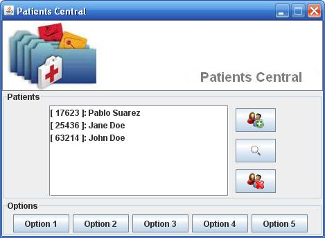
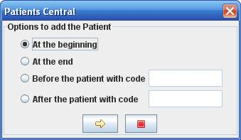
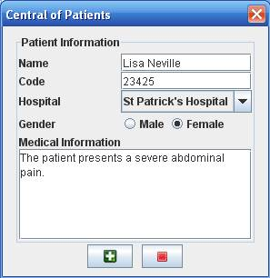
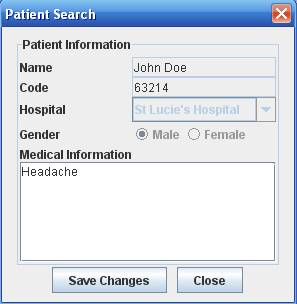

# Statement

A computer program is needed to manage the information from a group of patients
being treated at different clinics in the city. For each patient, the application
must store a numeric code that is unique (76527, for example), a name ("Mariana
Chacon), the name of the clinic to which was referred the patient ("Hospital
Reina Sofía"), the patient medical information ("Earache") and gender (Female).

It is expected that the program is able to add a patient, watching four possible
variants: insert at the beginning of the patient list, insert at the end, insert
after another patient (given its code) or inserted before another patient (given
its code.) It should also allow a patient to remove or edit its medical
information, for which the user must supply the respective patient's code.

For ease of implementation, it is not necessary that the information is persistent.

## Graphical User Interface

The application must have a gui similar to the following:

Application main window

Dialogue to select the preferred addition of a patient

Dialogue to enter patient data

Dialogue to display information from a patient